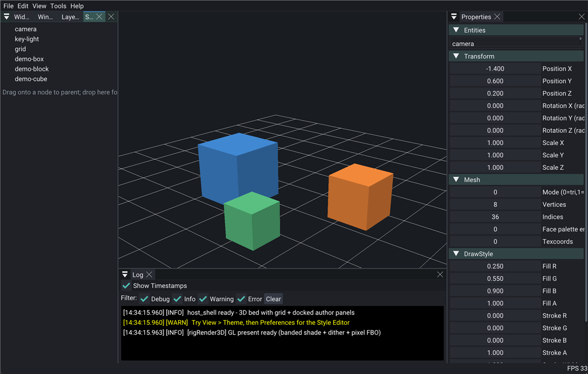

# RigKit



**RigKit** is a lightweight creative application host for **media installations** and **artist tool apps**. It **is Rig**: a coded host of **[RigWorks](https://github.com/rigkid/RigWorks)** (SUDE + ECS + shared POD schemas; **Rig** for short). Author path is **Rig + UI** via **rigImGui** — hero above is [`packs/rigImGui/examples/host_shell`](packs/rigImGui/examples/host_shell/).

[RigWorks](https://github.com/rigkid/RigWorks) · [honors](https://github.com/rigkid/RigWorks/blob/main/docs/honors.md) · [Site](https://rigkid.github.io/rigkit/) · [API](https://rigkid.github.io/rigkit/api/) · [Docs index](docs/README.md) · [Contract / host](docs/contract/README.md) · [port map](docs/contract/port-map.md) · [SUDE loop](docs/contract/sude-loop.md) · [ECS conventions](docs/contract/rigkit.md) · [Canvas / Managers](docs/managers.md). Start with [`examples/minimal`](examples/minimal/) or [`examples/oscHost`](examples/oscHost/README.md) (`--author` / `--show`). Artist surface: [`docs/authoring.md`](docs/authoring.md).

## Dependencies

| Library     | Purpose                 | How Managed |
|-------------|-------------------------|-------------|
| [GLFW3]     | Window / input          | submodule   |
| [GLM]       | Math                    | submodule   |
| [GLAD]      | OpenGL loader           | vendored    |
| [EnTT]      | ECS                     | submodule   |
| [spdlog]    | Logging                 | submodule   |
| [nlohmann/json] | Settings / JSON     | submodule   |

## Prerequisites

- CMake 3.19 or higher
- C++20 compatible compiler (MSVC, clang, or gcc)

## Quick Start

```bash
git clone https://github.com/rigkid/RigKit && cd RigKit
git submodule update --init --recursive
cmake -S examples/oscHost -B examples/oscHost/build
cmake --build examples/oscHost/build --target oscHost
```

See [docs/build_instructions.md](docs/build_instructions.md). In-tree example apps live under [`examples/`](examples/). Product apps belong in their own repositories; start from [`templates/app`](templates/app/).

## Packs

Known and planned packs: [`docs/packs_catalog.md`](docs/packs_catalog.md). Pinning, heroes, CI, and scaffold: [`packs/README.md`](packs/README.md).

## Contributing

Humans and AI agents are both welcome — same [Ten Commandments](docs/contract/commandments.md), same gates.

- [docs/contributing.md](docs/contributing.md)
- Agent playbook: [AGENTS.md](AGENTS.md)

## License

RigKit is MIT licensed — see [LICENSE](LICENSE).

## Thank you!

RigKit is a vision of tools after years of playing with code of others. Most heavy lifting code is theirs. I stand on their shoulders. (All bugs are mine).

- **Adam Templeton**, Senior Application Engineer at [ENESS] thanks for teaching me to program C++, and for the years of practice around **Pixile**.
- **Zach Lieberman**, **Theodore Watson**, **Arturo Castro**, **Dan Rosser** and the [openFrameworks] community for the artist-first host and addon culture this lineage grew up in.
- **Omar Cornut** [Dear ImGui].
- **Michele Caini** [EnTT].
- **Petr Kobalicek** [Blend2D].
- **Camilla Löwy** [GLFW3]; **Christophe Riccio** [GLM]; **Niels Lohmann** [nlohmann/json]; **Gabi Melman** [spdlog]; **David Herberth** [GLAD].

And many **many** others!

[ENESS]: https://eness.com/
[openFrameworks]: https://openframeworks.cc/
[DrawBot]: https://drawbot.com/
[GLFW3]: https://github.com/glfw/glfw
[GLM]: https://github.com/g-truc/glm
[GLAD]: https://github.com/Dav1dde/glad
[Dear ImGui]: https://github.com/ocornut/imgui
[Blend2D]: https://github.com/blend2d/blend2d
[EnTT]: https://github.com/skypjack/entt
[spdlog]: https://github.com/gabime/spdlog
[nlohmann/json]: https://github.com/nlohmann/json
