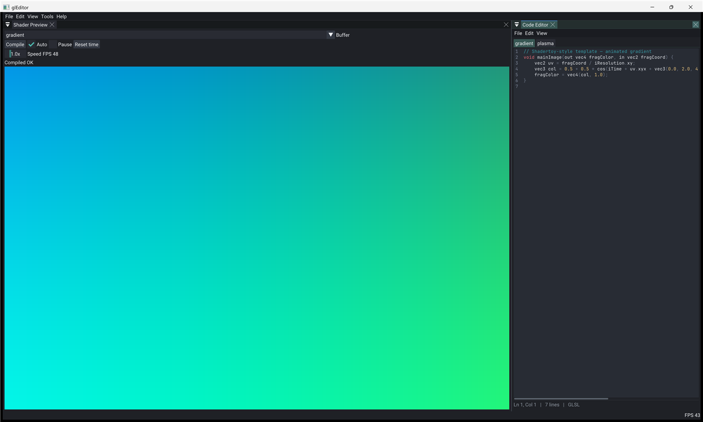

# glEditor



RigKit port of the [gleditor](https://github.com/1ay1/gleditor) workflow - edit GLSL, live preview, compile errors, Shadertoy uniforms - on **Rig + UI** (ImGui), not GTK.

## First-run chrome

On first boot (no saved `data/user/workspaces/imgui.ini` split):

| Region | Window |
|--------|--------|
| Center | **Shader Preview** - Compile / Auto / Pause / FPS / errors + FBO image |
| Right | **Code Editor** (`rigCodeEditor`) - GLSL highlight over `CCode` buffers |

Layout is saved under `data/user/workspaces/imgui.ini`. Reset by deleting that file (or the example `build/` tree and reconfiguring).

Seeded buffers: `data/gradient.glsl`, `data/plasma.glsl` (`language = "glsl"`).

## Shadertoy uniforms

```glsl
uniform vec3 iResolution;
uniform float iTime;
uniform vec4 iMouse; // xy current, zw click
void mainImage(out vec4 fragColor, in vec2 fragCoord);
```

Host wraps `mainImage` for GLES (`#version 100`) or desktop (`#version 330`).

## Live reload (TODO.md beachhead)

Repo TODO: *runtime hot-reload (DLL / shader)*. This example probes the **shader** half only:

| Layer | Behavior here |
|-------|----------------|
| **Shader source** | Edit `CCode` then auto-compile (debounce), then swap GPU program; **keep last-good** on failure |
| **Disk watch** | If `CAssetRef` is on the same entity, poll mtime, then reload text, bump `epoch` (external editor) |
| **Pack DLL** | **Not implemented** - `MPack::reloadPack` still re-inits STATIC only; no `dlopen` |

Structure stays open for a future pack SHARED path; this app does not add one.

## Build

```bash
cmake -S examples/glEditor -B examples/glEditor/build
cmake --build examples/glEditor/build --target glEditor
./examples/glEditor/build/bin/glEditor/glEditor
./examples/glEditor/build/bin/glEditor/glEditor --smoke
```

## Packs

- **rigComponent** - `CCode`
- **rigSystems** - present spine
- **rigImGui** - dock host
- **rigCodeEditor** - TextEditorPanel + JetBrains Mono (author-tool weight; opt-in)

## Still deferred

Multipass BufferA-D, adaptive resolution, NeoWall install, theme library, GLSL autocomplete, session tab restore, promoting preview into a pack, pack DLL hot-reload.

## Pi note

Author-tool chrome (code editor font) - fine for desktop authoring. Preview path uses GLES `#version 100` when `RIGKIT_GLES` so Pi/ANGLE builds match the host floor.
