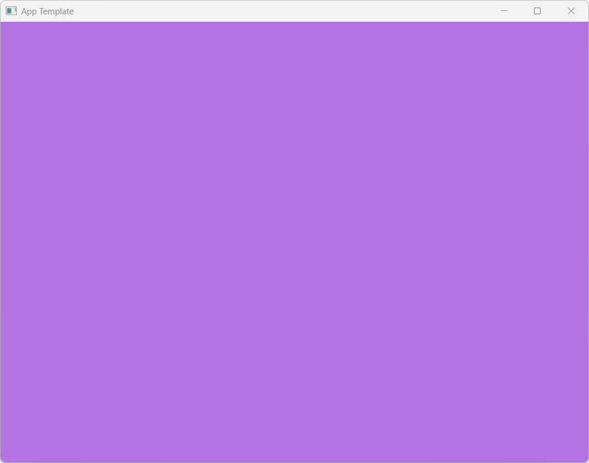

# RigKit::minimal



Minimal creator + mesh proof. Build and run `minimal`: expect a blue rect (selected - yellow bounds), orange circle, yellow triangle mesh, parent/child hierarchy, and green quad on a dark clear color.

```bash
cmake -S examples/minimal -B examples/minimal/build
cmake --build examples/minimal/build --target minimal
./examples/minimal/build/bin/minimal/minimal   # or minimal.exe on Windows
```

See [docs/authoring.md](../../docs/authoring.md).
