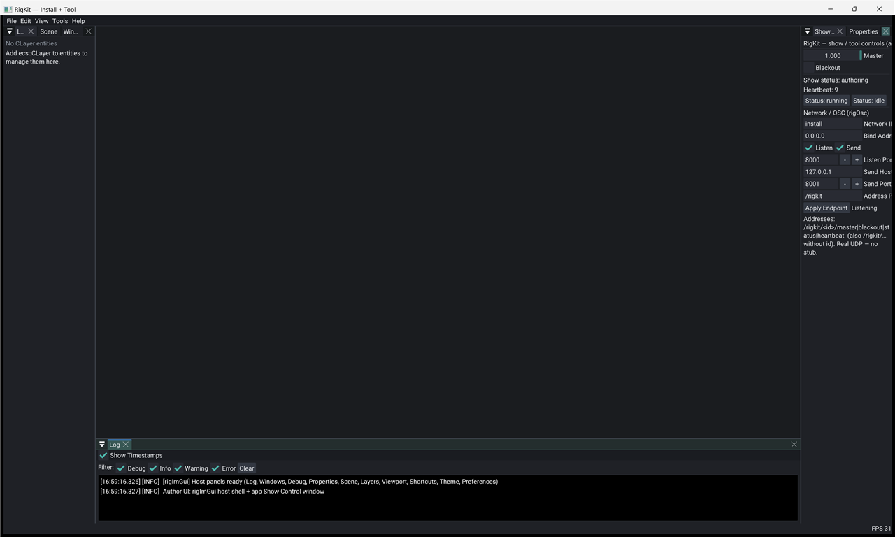

# oscHost



RigKit **OSC show host** - one binary, author + show modes, multi-instance via **network id** and UDP (`rigOsc`).

Default window is **640×400** so two instances fit on one desktop.

## Modes (one binary)

| Mode | Flag | What you get |
|------|------|----------------|
| **Author** | `--author` (default) | rigImGui host shell + Show Control (network id, ports, master / blackout) |
| **Show** | `--show` / `--install` | UI-light: rigImGui detached; clear-color present; identity from CLI |

## Network (shared with product apps)

After registering **rigOsc**, any app applies the same CLI:

```cpp
m_osc->applyCommandLine(args);           // sets PODs + rebind + logs identity
std::cout << rigkit::rigOsc::commandLineHelp();
```

| Flag | Meaning |
|------|---------|
| `--network-id=ID` / `--id=ID` | OSC id (default `install`) |
| `--listen-port=N` | UDP listen (default `8000`) |
| `--send-host=HOST` | UDP peer host (default `127.0.0.1`) |
| `--send-port=N` | UDP peer port (default `8001`) |
| `--bind-address=ADDR` | Listen bind (default `0.0.0.0`) |
| `--smoke-osc` | Bind, loopback master, exit (oscHost only) |

`=` or a following value both work (`--id=box-a` or `--id box-a`).

```bash
# Instance A (author) - listen 8000, send to B on 8001
./oscHost --author --network-id=box-a --listen-port=8000 --send-port=8001

# Instance B (show) - listen 8001, send back to A on 8000
./oscHost --show --network-id=box-b --listen-port=8001 --send-host=127.0.0.1 --send-port=8000
```

Move Master or Color on A; within about a second B’s clear color follows (heartbeat tick pushes bus). Addresses: `/rigkit/<networkId>/master|blackout|color|...`; bare `/rigkit/...` is broadcast. `color` is three floats.

## Dependencies

- `rigImGui` - host shell (author mode only)
- `rigOsc` - real UDP OSC + `CNetworkIdentity` / show bus

## Build

```bash
cmake -S examples/oscHost -B examples/oscHost/build
cmake --build examples/oscHost/build --target oscHost
./examples/oscHost/build/bin/oscHost/oscHost --show --network-id=box-a
./examples/oscHost/build/bin/oscHost/oscHost --author
./examples/oscHost/build/bin/oscHost/oscHost --smoke-osc
```

Author layout is saved under `data/user/workspaces/imgui.ini`. Reset by deleting `examples/oscHost/build/` and reconfiguring.

See [docs/contract/distribution.md](../../docs/contract/distribution.md).
