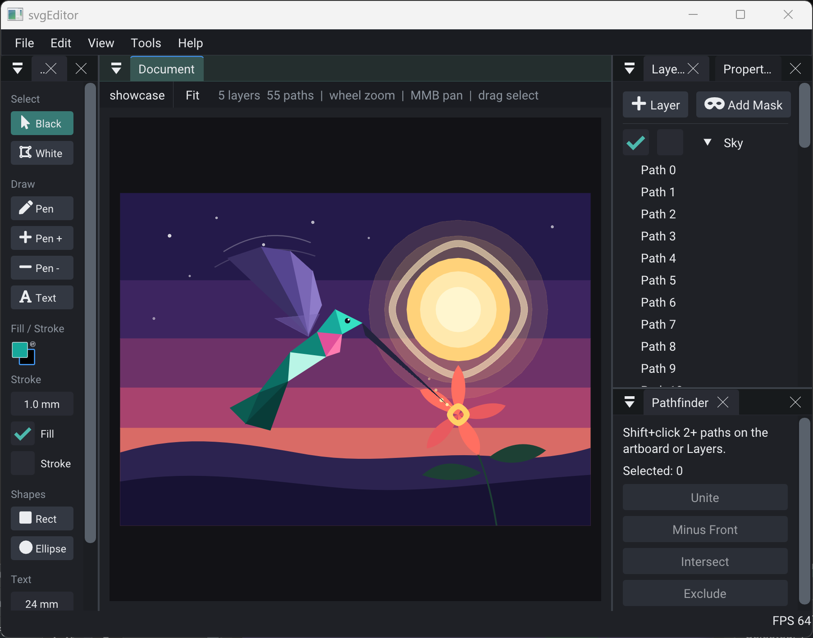

# svgEditor



Dedicated **SVG editor shell** example - not the plotter CNC kit.

## First-run chrome

| Region | Window |
|--------|--------|
| Left | **Toolbar** - Select / Pen / Rect / Ellipse / Text outlines |
| Center | **Artboard** - warm paper on dark desk, filled + stroked paths |
| Right top | **Layers** \| **Properties** (tabs) |
| Right bottom | **Pathfinder** \| **Align** (tabs) |

Demo: Letter (filled compound `a`) + Blob (stroked circle), letter preselected.

## Build

```bash
cmake -S examples/svgEditor -B examples/svgEditor/build
cmake --build examples/svgEditor/build --target svgEditor
./examples/svgEditor/build/bin/svgEditor/svgEditor
./examples/svgEditor/build/bin/svgEditor/svgEditor --smoke
```

## Packs

- **rigSvgEditorUi** - shell UI (this example’s product surface)
- **rigVectorEditor** - path edit / text / Pathfinder / soft mask
- **rigColorspace** - color POD + conversion, grey value / contrast, harmonies (Swatches UI later)
- **rigCompositor** - FBO bake/blit + path masks (Layers Add Mask to artboard composite)
- **rigPlotter** + **rigSvg** - document + SVG I/O
- **rigImGui** - dock host

CNC plotter panels (`rigPlotterUi` Finders/Generators/GRBL/...) are **not** registered.

## Still deferred

Full Modify tools, Swatches/CMYK UI, Tab edit mode, Pages bar, Object menu Arrange, pencil,
polygon, gradient editor modal.
